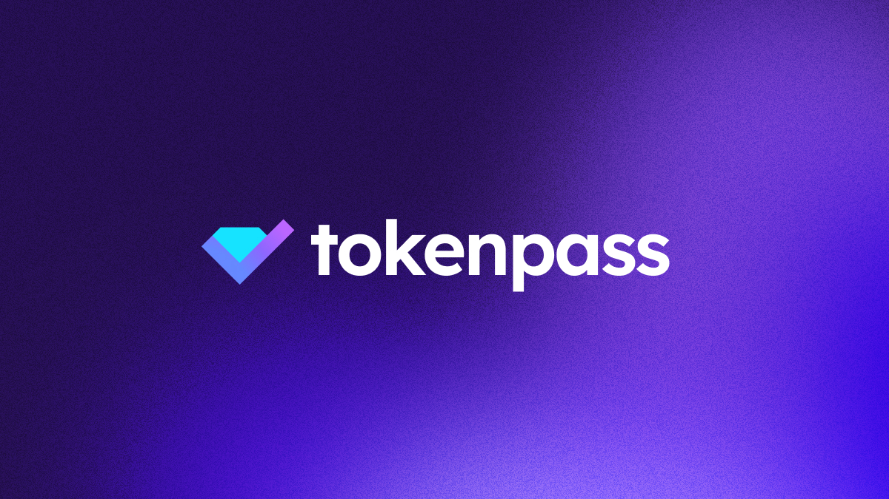

# ✅ tokenpass

Using the unique power of blockchain.

## Stack
- [Vue 3](https://vuejs.org)
- [Nuxt 3](https://v3.nuxtjs.org)
- [VueUse](https://vueuse.org)
- [Tailwind CSS](https://tailwindcss.com)
- [WalletConnect v2](https://walletconnect.com)
- Icons: [`ionicons`](https://ionic.io/ionicons)
- UI: [`headless-ui`](https://headlessui.com/vue/menu)
- Validation: [`vuelidate`](https://vuelidate-next.netlify.app)
- Testing:
  - Unit: [`vitest`](https://vitest.dev)

## Contributing

Check [contributing guide](.github/CONTRIBUTING.md).
